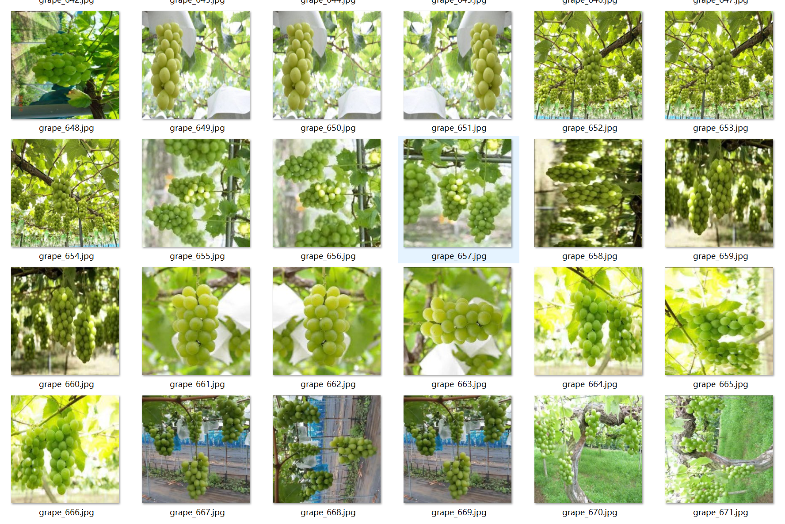
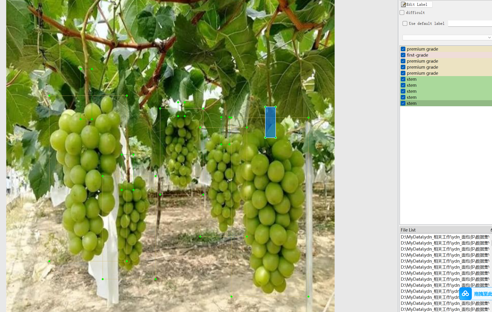
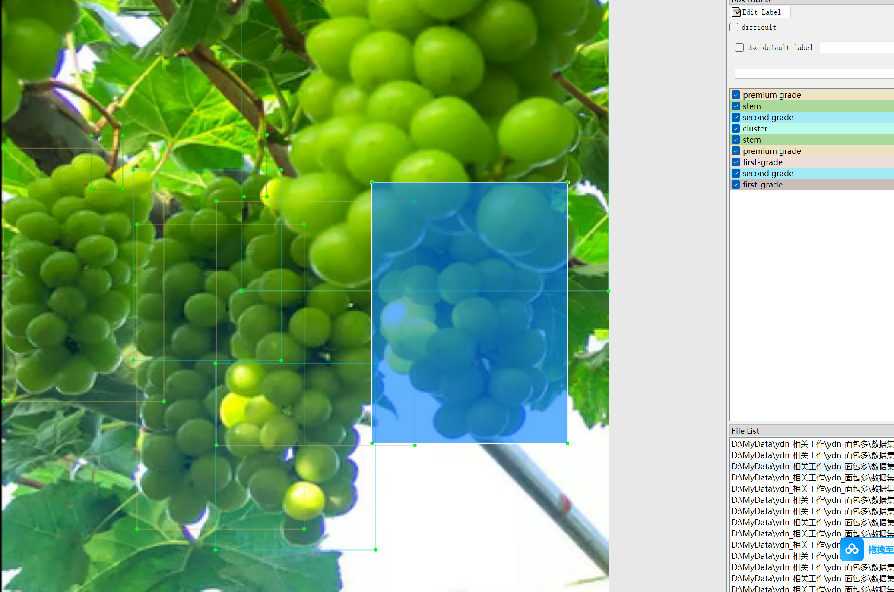
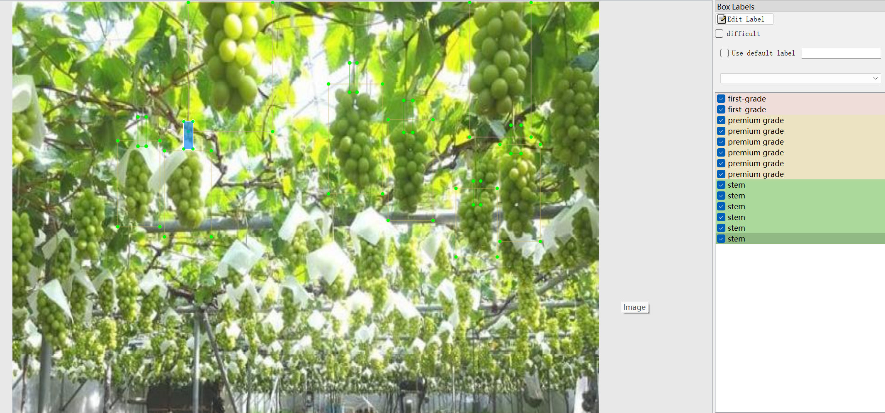
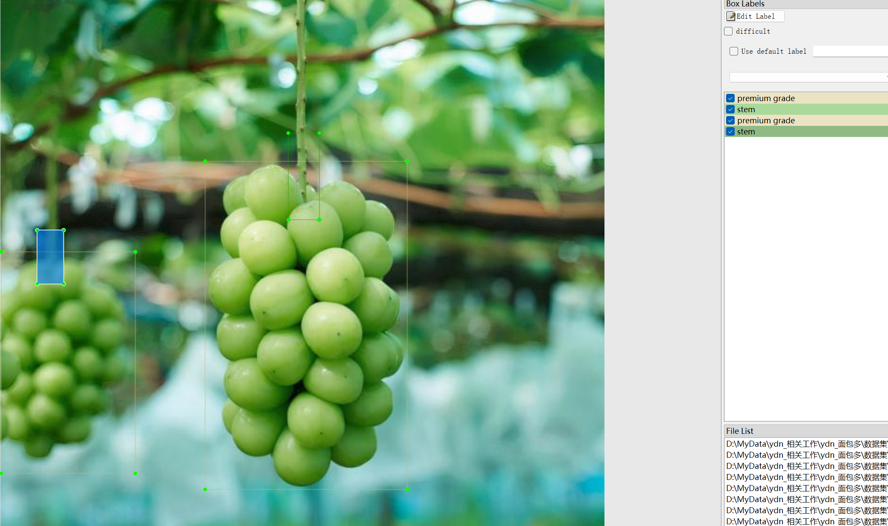

# Grape Fruit Classification and Grape Cluster Identification - Target Detection Dataset

Dataset Information: The dataset consists of 3478 images, each paired with a corresponding annotation file. The annotation files are provided in two formats: VOC (xml) and YOLO (txt).

Annotation Objects Include:
- 'second grade'
- 'stem'
- 'premium grade'
- 'first-grade'
- 'cluster'
- 'third grade'
- 'defective grade'

Annotation Box Count Information: (Note that an image may have multiple objects annotated, hence the total number of annotation boxes may be greater than the total number of images.)

The complete dataset includes three folders and one txt file:
- all_images folder: Stores the dataset images. Screenshots are as follows:

Image Size Information:
- all_txt folder and classes.txt: Stores YOLO format txt annotation files, in the same quantity as the images, each annotation file corresponds to one image.
- classes.txt:
  - For detailed understanding of the YOLO format standard files, please search for it yourself on Baidu. In short, the index 0 represents the name of the item at the array 0 position in classes.txt.

all_xml folder: VOC format xml annotation file.
- The quantity and images are the same, each annotation file corresponds to one image.
- For detailed understanding of the VOC format standard files, please search for it yourself on Baidu.

Both formats of annotations can be used, choose one based on your preference.

Annotation Screenshots:

## Images

Here is a pay link on Stripe ( https://buy.stripe.com/3cs8yP7sY87d0vu9AB ). Please contact me lonlonago@foxmail.com after funding $89, and I will send you a complete data files , thank you!

